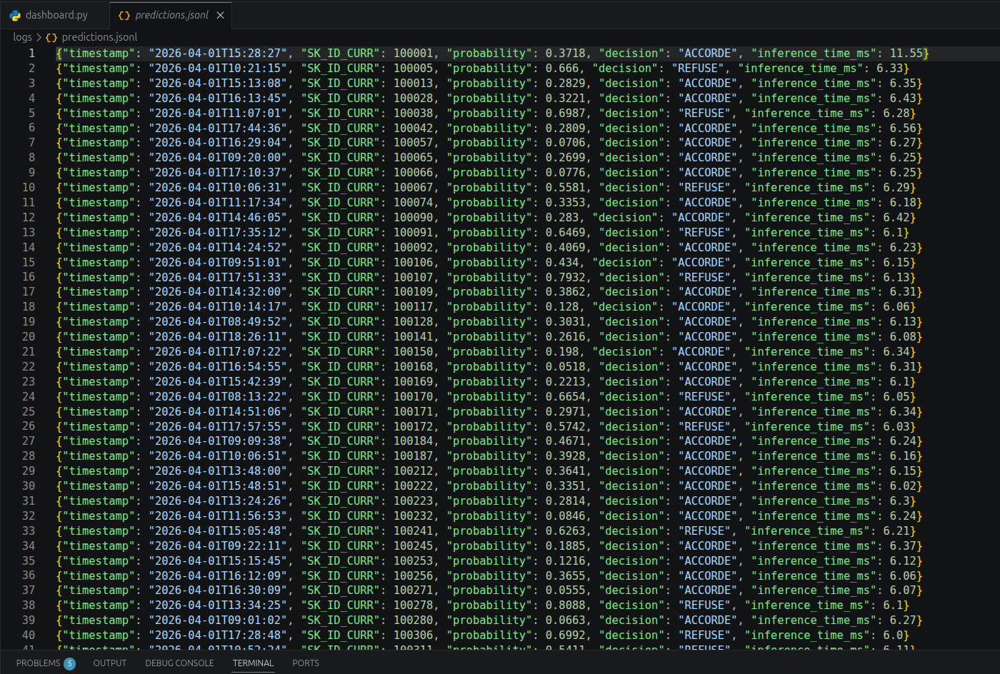
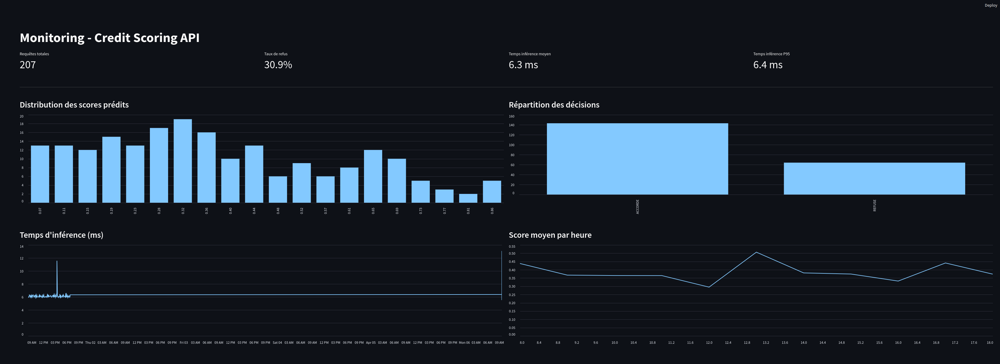
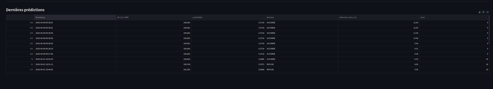

# Credit Scoring MLOps

API de scoring crédit pour l'entreprise "Prêt à Dépenser". Ce projet déploie un modèle LightGBM qui prédit la probabilité de défaut de paiement d'un client.

## Lancer l'API

```bash
# Avec Docker
docker build -t credit-scoring-api .
docker run -p 8000:8000 credit-scoring-api

# Sans Docker
pip install -r requirements.txt
uvicorn app:app --host 0.0.0.0 --port 8000
```

## Endpoints

- `GET /health` — vérification de l'état de l'API
- `POST /predict?SK_ID_CURR=100001` — prédiction pour un client
- `GET /docs` — documentation Swagger auto-générée

## Lancer les tests

```bash
pytest tests/ -v --cov=app
```

## Monitoring

L'API log chaque prédiction en JSON structuré dans `logs/predictions.jsonl` :
- timestamp, SK_ID_CURR, probabilité, décision, temps d'inférence

L'analyse de drift est dans `notebooks/data_drift_analysis.ipynb` (Evidently AI).

Le dashboard Streamlit visualise les métriques de production :
```bash
streamlit run dashboard.py
```

## Stockage des données de production

**Stratégie** : logging structuré JSON (fichier JSONL local).

Chaque appel à l'API enregistre automatiquement dans `logs/predictions.jsonl` :
- `timestamp` : date/heure de la requête
- `SK_ID_CURR` : identifiant du client
- `probability` : score de probabilité de défaut
- `decision` : ACCORDE ou REFUSE
- `inference_time_ms` : temps d'inférence en millisecondes

Ce format permet :
- L'analyse de drift (comparaison des distributions de scores)
- Le suivi de la latence et des performances
- La détection d'anomalies (taux de refus, temps de réponse)

Screenshots de la solution :





## Optimisation

Le classifieur LightGBM a été converti en ONNX Runtime :
- Taille modèle : 732 KB → 444 KB (-39%)
- Temps d'inférence : ~5.6 ms → ~5.3 ms (+6%)

## Structure du projet

```
├── app.py                # API FastAPI (ONNX)
├── dashboard.py          # Dashboard Streamlit
├── src/preprocessing.py  # Preprocessing du modèle
├── tests/                # Tests unitaires (98% coverage)
├── model/                # model.pkl + model.onnx
├── data/processed/       # Données clients
├── notebooks/            # Analyse data drift
├── logs/                 # Logs de prédiction (JSONL)
├── Dockerfile
├── requirements.txt
└── .github/workflows/    # Pipeline CI/CD
```
