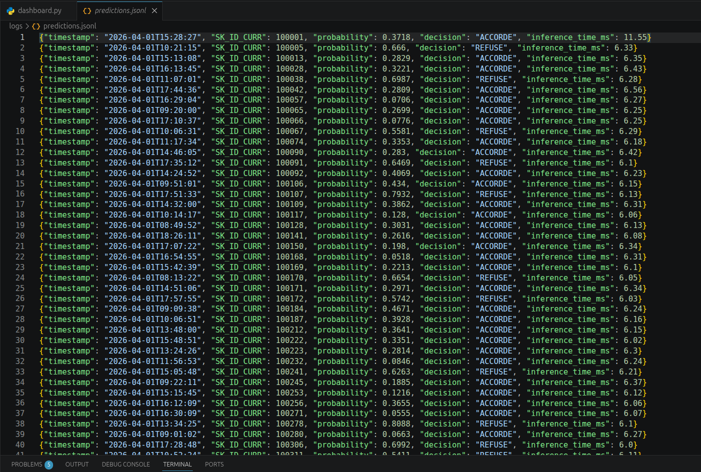
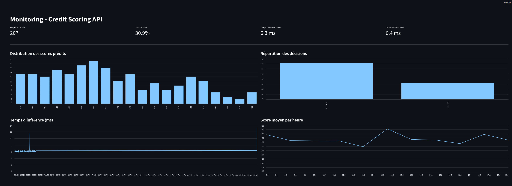
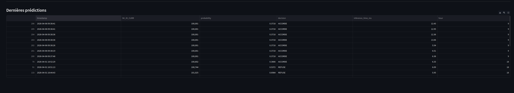

# Credit Scoring MLOps

API de scoring crédit pour l'entreprise "Prêt à Dépenser". Ce projet déploie un modèle LightGBM qui prédit la probabilité de défaut de paiement d'un client.

**API en ligne :** https://clementrbl-credit-scoring-api.hf.space/docs
**Suivi des modèles (MLflow sur DagsHub) :** https://dagshub.com/clementRbl/credit-scoring-mlops.mlflow
**Pilotage du projet :** https://github.com/users/clementRbl/projects/5

## V2 : surveillance et réentraînement automatiques

Un modèle de crédit se dégrade en silence quand la clientèle ou les comportements
changent. La V2 ferme la boucle : chaque lundi, un workflow surveille le dernier
lot mensuel reçu ; en cas d'alerte, il ouvre une issue, réentraîne un challenger
et, si celui-ci fait mieux, propose sa mise en production dans une Pull Request.
Un humain valide : c'est une décision de crédit.

```
lot mensuel ──▶ surveillance ──┬── rien à signaler ──▶ fin
   (DVC)        Evidently      │
                + coût métier  └── alerte ──▶ issue GitHub
                                    │
                                    ▼
                          challenger réentraîné (MLflow, alias « challenger »)
                                    │
                          règle de promotion ──┬── non : le champion reste
                                               └── oui : Pull Request
                                                    ──▶ fusion ──▶ CI/CD ──▶ alias « champion »
```

| Brique | Outil | Rôle |
|---|---|---|
| Versions des données | DVC, stockage DagsHub | Référence, lots mensuels, test figé |
| Versions des modèles | MLflow Model Registry (DagsHub) | Alias `champion` (servi) et `challenger` |
| Surveillance | Evidently 0.4.33 + coût métier | Dérive des données et dérive de concept |
| Orchestration | GitHub Actions | Chaque lundi et à la demande (`monitoring.yml`) |
| Service | FastAPI | Seuil et version lus dans `model/model_meta.json` |

### Deux déclencheurs, parce qu'ils ne voient pas la même chose

- **Dérive des données** : au moins 30 % des 20 variables les plus importantes du
  champion changent de distribution (Evidently).
- **Coût métier** (`10 × FN + 1 × FP` par demande) : plus de 10 % au-dessus de la
  référence. Il voit la dérive de concept, invisible pour un test de dérive des
  données. Il suppose les défauts du lot connus, ce qui arrive quelques mois après
  l'octroi.

### Le scénario simulé

Le jeu Home Credit n'a pas de dates. Les 307 511 demandes étiquetées sont découpées
une fois pour toutes : 60 % de référence (entraîne le champion v1), 20 % en quatre
lots mensuels, 20 % de test figé jamais appris. Le modèle de la V1 avait vu 100 %
des données : il a été réentraîné sur la seule référence, sans quoi la simulation
aurait été faussée.

| Mois | Ce qui change | Variables qui dérivent | Coût métier | Résultat |
|---|---|---|---|---|
| 1 | Rien | 0 % | +2 % | Aucune alerte |
| 2 | Rien | 0 % | −0 % | Aucune alerte |
| 3 | Clientèle plus jeune, montants × 1,3 | 35 % | +13 % | Alerte ; challenger **non promu** (+0,8 %) |
| 4 | 15 % des bons payeurs d'un segment font défaut | 0 % | +46 % | Alerte ; challenger **promu** (−8,1 %) |

Le mois 3 montre qu'une population plus risquée ne rend pas le modèle faux :
réentraîner n'apporte rien, et la règle évite une mise en production inutile.

### Règle de promotion

Le challenger apprend sur la référence, les mois reçus et 70 % du mois courant.
Il est comparé au champion sur les 30 % restants, que ni l'un ni l'autre n'a vus.
Il est promu si son coût métier y est **inférieur d'au moins 1 %**, et s'il ne
dégrade pas de **plus de 2 %** le test figé. Chaque modèle garde son propre seuil
de décision, choisi en validation croisée.

### Lancer le pipeline en local

```bash
uv venv && uv pip install -r requirements-pipeline.txt
cp .env.example .env                          # DAGSHUB_USER et DAGSHUB_TOKEN
dvc remote modify origin --local user <identifiant DagsHub>
dvc remote modify origin --local password <jeton DagsHub>
dvc pull                                      # données versionnées

python -m pipeline.monitor --month 4          # rapports dans reports/month_4/
python -m pipeline.retrain --month 4          # challenger + décision de promotion
```

Pour rejouer le découpage et les lots : `python -m pipeline.split`, puis
`python -m pipeline.simulate --month N` (déterministe, graine fixe).

### Limites assumées

- La dérive est mesurée par rapport à la population d'origine, même après une promotion.
- Les écarts de coût sur un mois (quelques milliers de demandes) restent bruités :
  la marge de 1 % ne protège pas d'un gain dû au hasard.
- Les prédictions de l'API restent journalisées dans un fichier local au conteneur.

## Lancer l'API

```bash
# Avec Docker
docker build -t credit-scoring-api .
docker run -p 8000:8000 credit-scoring-api

# Sans Docker
uv venv && uv pip install -r requirements.txt
uvicorn app:app --host 0.0.0.0 --port 8000
```

## Endpoints

- `GET /health` — état de l'API et version du modèle servi
- `POST /predict?SK_ID_CURR=100001` — prédiction pour un client
- `GET /docs` — documentation Swagger auto-générée

## Lancer les tests

```bash
pytest tests/ -v --cov=app --cov=pipeline
```

## Monitoring

L'API log chaque prédiction en JSON structuré dans `logs/predictions.jsonl` :
- timestamp, SK_ID_CURR, probabilité, décision, temps d'inférence

L'analyse de drift est dans `notebooks/data_drift_analysis.ipynb` (Evidently AI).

Le dashboard Streamlit visualise les métriques de production :
```bash
streamlit run dashboard.py
```

## Stockage des données de production

**Stratégie** : logging structuré JSON (fichier JSONL local).

Chaque appel à l'API enregistre automatiquement dans `logs/predictions.jsonl` :
- `timestamp` : date/heure de la requête
- `SK_ID_CURR` : identifiant du client
- `probability` : score de probabilité de défaut
- `decision` : ACCORDE ou REFUSE
- `inference_time_ms` : temps d'inférence en millisecondes

Ce format permet :
- L'analyse de drift (comparaison des distributions de scores)
- Le suivi de la latence et des performances
- La détection d'anomalies (taux de refus, temps de réponse)

Screenshots de la solution :





## Optimisation

ONNX Runtime a été testé (+6% vitesse, -39% taille) mais retiré volontairement : le risque d'erreurs silencieuses sur les features catégorielles ne justifiait pas le gain marginal. L'API utilise directement `pipeline.predict_proba()` pour une inférence fiable (~6 ms).

## Structure du projet

```
├── app.py                    # API FastAPI (LightGBM)
├── dashboard.py              # Dashboard Streamlit
├── src/                      # Prétraitement et coût métier
├── pipeline/                 # V2 : découpage, simulation, surveillance, réentraînement
├── tests/                    # Tests (API couverte à 96 %)
├── model/                    # model.pkl + model_meta.json (seuil, version)
├── data/processed/           # Demandes servies par l'API
├── data/*.dvc                # Pointeurs DVC des données du pipeline
├── docs/features/            # Cadrage de la V2
├── notebooks/                # Analyse de drift de la V1
├── Dockerfile
├── requirements.txt          # API
├── requirements-pipeline.txt # Pipeline (MLflow, DVC)
└── .github/workflows/        # CI/CD et surveillance hebdomadaire
```
